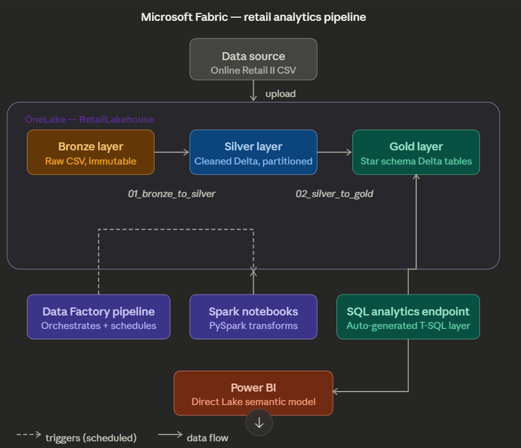

# Microsoft Fabric Retail Analytics Pipeline
 
End-to-end data engineering pipeline on Microsoft Fabric implementing
the Medallion Architecture (Bronze → Silver → Gold) for retail analytics.
 
## Architecture

 
## Tech Stack
| Layer          | Fabric Component         | Purpose                        |
|----------------|--------------------------|--------------------------------|
| Storage        | OneLake (Lakehouse)      | Bronze/Silver/Gold layers      |
| Ingestion      | Fabric Data Pipeline     | Orchestration & scheduling     |
| Transform      | Spark Notebooks (PySpark)| Bronze→Silver→Gold transforms  |
| Serving        | SQL Analytics Endpoint   | T-SQL queries on Gold tables   |
| Reporting      | Power BI (Direct Lake)   | Interactive dashboards         |
 
## Data Model
Star schema with 1 fact table and 3 dimensions:
fact_sales → dim_customer, dim_product, dim_date
 
## Key Design Decisions
- Delta format throughout for ACID transactions and time travel
- Partitioned Silver by Country for query pruning
- Direct Lake mode in Power BI for near real-time performance
- Scheduled daily pipeline refresh via Fabric trigger
 
## Certifications
Built as hands-on preparation for DP-700: Microsoft Certified Fabric Data Engineer Associate
